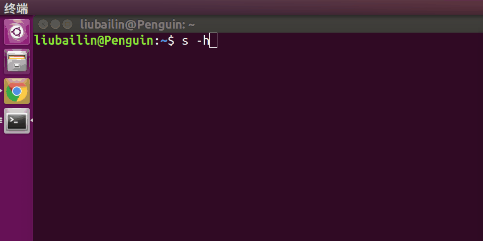

## 整个程序构架不是太好，等我有时间，重做，使更具扩展性。
## The entire program architecture is bad, so I will redo and make it more extensible when I have plenty of time.
# iword
一个跨平台的命令行词典
## 使用
	 使用: s [OPTION]... [word]  
					--en 发英音
					--am 发美英
					-j --jushi 显示例句
					-h --help 显示帮助
					-a --about 显示关于
## 演示

## 编译
	编译 run.c生成功执行文件
	编译java程序 ，可用eclipse直接导出为jar把生成的jar命名为 s.jar然后和c语言生成的可执行文件放在同一目录。
## 安装
	添加进环境变量，就行了。 

